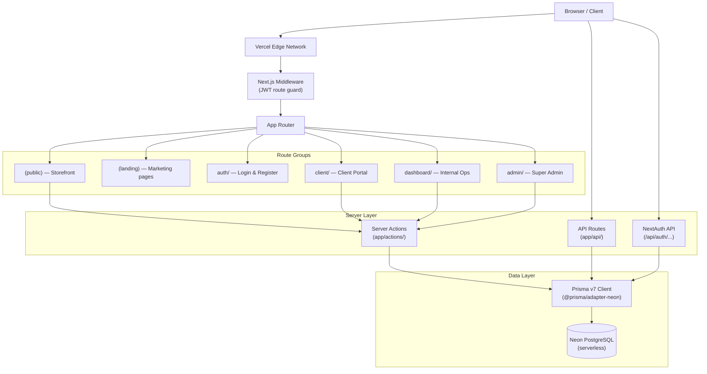
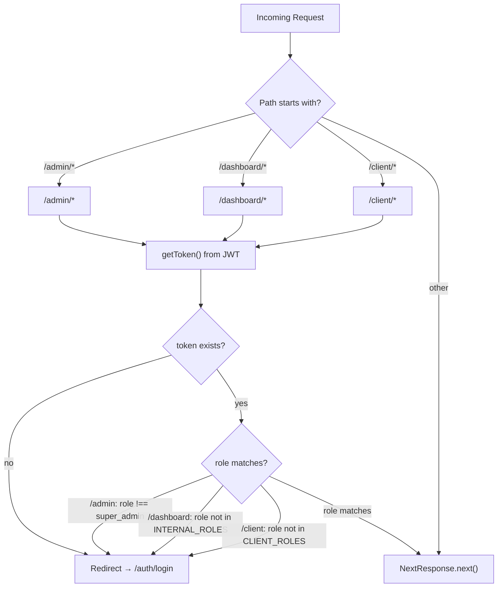
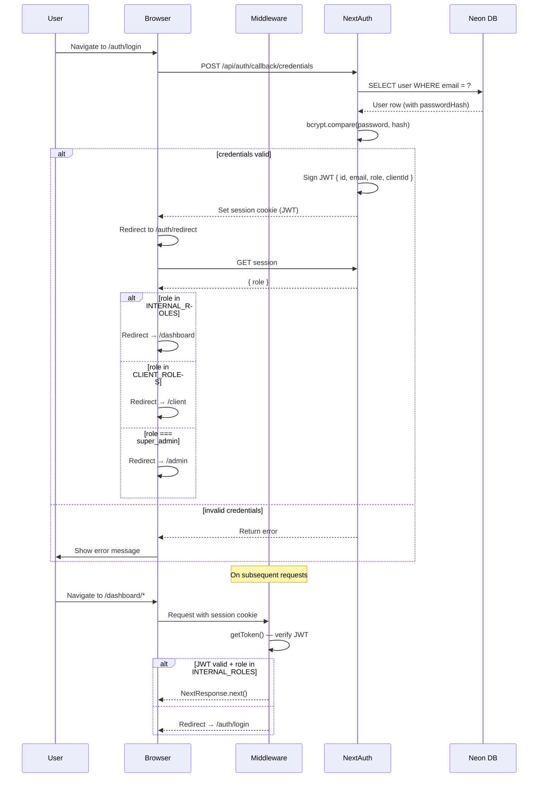

# Architecture

## System Overview

Kawasan Digital ID is a monolithic Next.js 16 App Router application deployed on Vercel. All three personas (Storefront, Client Portal, Internal Dashboard) are served from a single codebase, separated by route groups and protected by edge middleware.

## Full System Diagram



## Route Groups

| Route Group | Path Prefix | Access | Purpose |
|-------------|-------------|--------|---------|
| `(public)` | `/` | Anyone | Storefront: templates, cart, checkout, orders |
| `(landing)` | `/home`, `/about`, `/services`, `/portfolio`, `/contact` | Anyone | Marketing / landing pages |
| `auth` | `/auth/login`, `/auth/register`, `/auth/redirect` | Anyone | Authentication flows |
| `client` | `/client/*` | `client_admin`, `client_contact` | Client self-service portal |
| `dashboard` | `/dashboard/*` | All staff roles | Internal operations dashboard |
| `admin` | `/admin/*` | `super_admin` only | Platform administration |

### Storefront `(public)` Pages

| Route | Page |
|-------|------|
| `/` | Home / storefront landing |
| `/templates` | Service template catalogue |
| `/templates/[id]` | Template detail |
| `/custom` | Custom project inquiry builder |
| `/cart` | Shopping cart |
| `/checkout` | Checkout flow |
| `/orders/track` | Public order tracker |
| `/orders/success` | Post-order confirmation |
| `/help` | Help & FAQs |
| `/privacy` | Privacy policy |
| `/terms` | Terms of service |
| `/refund` | Refund policy |

### Marketing `(landing)` Pages

| Route | Page |
|-------|------|
| `/home` | Agency landing page |
| `/about` | About the agency |
| `/services` | Services overview |
| `/portfolio` | Portfolio showcase |
| `/contact` | Contact form |

### Client Portal `/client/*`

| Route | Page |
|-------|------|
| `/client` | Client dashboard overview |
| `/client/projects` | Project tracker |
| `/client/invoices` | Invoice list |
| `/client/payments` | Payment submission |
| `/client/contracts` | Signed contracts |
| `/client/orders` | Order history |
| `/client/support` | Support tickets |
| `/client/infrastructure` | Domains & hosting |
| `/client/finance` | Finance summary |
| `/client/account` | Account settings |

### Internal Dashboard `/dashboard/*`

| Route | Page |
|-------|------|
| `/dashboard` | KPI overview |
| `/dashboard/projects` | All projects list |
| `/dashboard/projects/[id]` | Project detail |
| `/dashboard/projects/[id]/tasks` | Task board |
| `/dashboard/sales` | Sales pipeline |
| `/dashboard/sales/clients` | Client management |
| `/dashboard/sales/quotations` | Quotation management |
| `/dashboard/sales/contracts` | Contract management |
| `/dashboard/finance` | Invoice management |
| `/dashboard/finance/payments` | Payment verification |
| `/dashboard/support` | Support ticket queue |
| `/dashboard/infrastructure` | Domain & hosting registry |
| `/dashboard/settings` | Staff settings |

### Admin Panel `/admin/*`

| Route | Page |
|-------|------|
| `/admin` | Admin overview |
| `/admin/users` | User management |
| `/admin/clients` | Client management |
| `/admin/templates` | Service template management |

## Middleware Flow



**Role groups defined in `middleware.ts`:**

```ts
const INTERNAL_ROLES = ['super_admin', 'sales', 'project_manager', 'developer', 'finance', 'support', 'infra']
const CLIENT_ROLES   = ['client_admin', 'client_contact']
```

## Auth Flow Sequence


