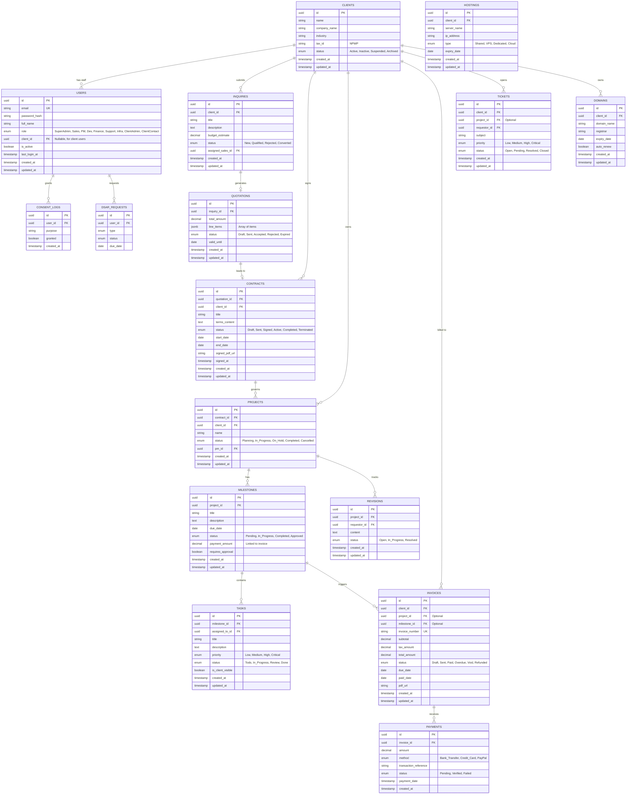

# Database Schema Design

## Overview
This document outlines the database schema for the Agency Internal Operations + Client Portal system. The database is designed using PostgreSQL 14+ to leverage its relational capabilities, JSON support, and Row-Level Security (RLS) features.

## Entity Relationship Diagram (ERD)



## Detailed Table Definitions

### 1. Identity & Access Management

#### `users`
Centralized user table for both internal staff and client representatives.
- `role`: Determines the base permission set.
- `client_id`: If NOT NULL, the user is restricted to that client's data (Row Level Security key).

```sql
CREATE TYPE user_role AS ENUM (
    'super_admin', 'sales_manager', 'project_manager', 'developer', 
    'finance_manager', 'support_agent', 'infra_admin', 
    'client_admin', 'client_contact'
);

CREATE TABLE users (
    id UUID PRIMARY KEY DEFAULT gen_random_uuid(),
    email VARCHAR(255) UNIQUE NOT NULL,
    password_hash VARCHAR(255) NOT NULL,
    full_name VARCHAR(100) NOT NULL,
    role user_role NOT NULL,
    client_id UUID REFERENCES clients(id) ON DELETE CASCADE, -- Null for internal users
    is_active BOOLEAN DEFAULT TRUE,
    last_login_at TIMESTAMPTZ,
    created_at TIMESTAMPTZ DEFAULT NOW(),
    updated_at TIMESTAMPTZ DEFAULT NOW()
);

-- Index for RLS performance
CREATE INDEX idx_users_client_id ON users(client_id);
```

### 2. CRM & Sales

#### `clients`
The core entity representing a customer organization.

```sql
CREATE TYPE client_status AS ENUM ('active', 'inactive', 'suspended', 'archived');

CREATE TABLE clients (
    id UUID PRIMARY KEY DEFAULT gen_random_uuid(),
    name VARCHAR(100) NOT NULL, -- Internal display name
    company_name VARCHAR(100), -- Legal name for invoices
    industry VARCHAR(50),
    tax_id VARCHAR(50), -- NPWP etc.
    status client_status DEFAULT 'active',
    address TEXT,
    created_at TIMESTAMPTZ DEFAULT NOW(),
    updated_at TIMESTAMPTZ DEFAULT NOW()
);
```

#### `inquiries`
Tracks sales leads before they become projects.

```sql
CREATE TYPE inquiry_status AS ENUM ('new', 'qualified', 'rejected', 'converted');

CREATE TABLE inquiries (
    id UUID PRIMARY KEY DEFAULT gen_random_uuid(),
    client_id UUID NOT NULL REFERENCES clients(id),
    title VARCHAR(200) NOT NULL,
    description TEXT,
    budget_estimate DECIMAL(12, 2),
    currency CHAR(3) DEFAULT 'IDR',
    status inquiry_status DEFAULT 'new',
    assigned_sales_id UUID REFERENCES users(id),
    created_at TIMESTAMPTZ DEFAULT NOW(),
    updated_at TIMESTAMPTZ DEFAULT NOW()
);
```

#### `quotations`
Formal price offers linked to inquiries. `line_items` is stored as JSONB for flexibility.

```sql
CREATE TYPE quote_status AS ENUM ('draft', 'sent', 'accepted', 'rejected', 'expired');

CREATE TABLE quotations (
    id UUID PRIMARY KEY DEFAULT gen_random_uuid(),
    inquiry_id UUID NOT NULL REFERENCES inquiries(id),
    quotation_number VARCHAR(50) UNIQUE NOT NULL, -- e.g., QT-2026-001
    total_amount DECIMAL(12, 2) NOT NULL,
    line_items JSONB NOT NULL DEFAULT '[]', 
    -- Structure: [{ "desc": "Design", "qty": 1, "rate": 5000000, "amount": 5000000 }]
    status quote_status DEFAULT 'draft',
    valid_until DATE,
    created_at TIMESTAMPTZ DEFAULT NOW(),
    updated_at TIMESTAMPTZ DEFAULT NOW()
);
```

### 3. Project Management

#### `projects`
The execution phase entity.

```sql
CREATE TYPE project_status AS ENUM ('planning', 'in_progress', 'on_hold', 'completed', 'cancelled');

CREATE TABLE projects (
    id UUID PRIMARY KEY DEFAULT gen_random_uuid(),
    contract_id UUID REFERENCES contracts(id),
    client_id UUID NOT NULL REFERENCES clients(id),
    name VARCHAR(200) NOT NULL,
    status project_status DEFAULT 'planning',
    pm_id UUID REFERENCES users(id), -- Project Manager
    repo_url VARCHAR(255),
    staging_url VARCHAR(255),
    production_url VARCHAR(255),
    created_at TIMESTAMPTZ DEFAULT NOW(),
    updated_at TIMESTAMPTZ DEFAULT NOW()
);
```

#### `milestones`
Major phases of a project, often tied to payments.

```sql
CREATE TYPE milestone_status AS ENUM ('pending', 'in_progress', 'completed', 'approved');

CREATE TABLE milestones (
    id UUID PRIMARY KEY DEFAULT gen_random_uuid(),
    project_id UUID NOT NULL REFERENCES projects(id) ON DELETE CASCADE,
    title VARCHAR(100) NOT NULL,
    description TEXT,
    due_date DATE,
    status milestone_status DEFAULT 'pending',
    payment_percentage DECIMAL(5, 2), -- e.g., 30.00 for 30%
    amount DECIMAL(12, 2), -- Fixed amount if not percentage
    requires_approval BOOLEAN DEFAULT TRUE,
    created_at TIMESTAMPTZ DEFAULT NOW(),
    updated_at TIMESTAMPTZ DEFAULT NOW()
);
```

#### `tasks`
Granular work items.

```sql
CREATE TYPE task_priority AS ENUM ('low', 'medium', 'high', 'critical');
CREATE TYPE task_status AS ENUM ('todo', 'in_progress', 'review', 'done');

CREATE TABLE tasks (
    id UUID PRIMARY KEY DEFAULT gen_random_uuid(),
    milestone_id UUID REFERENCES milestones(id) ON DELETE SET NULL,
    project_id UUID NOT NULL REFERENCES projects(id) ON DELETE CASCADE,
    assigned_to_id UUID REFERENCES users(id),
    title VARCHAR(200) NOT NULL,
    description TEXT,
    priority task_priority DEFAULT 'medium',
    status task_status DEFAULT 'todo',
    is_client_visible BOOLEAN DEFAULT FALSE, -- Key for client portal filtering
    due_date DATE,
    created_at TIMESTAMPTZ DEFAULT NOW(),
    updated_at TIMESTAMPTZ DEFAULT NOW()
);
```

### 4. Finance

#### `invoices`
Billing records.

```sql
CREATE TYPE invoice_status AS ENUM ('draft', 'sent', 'paid', 'overdue', 'void', 'refunded');

CREATE TABLE invoices (
    id UUID PRIMARY KEY DEFAULT gen_random_uuid(),
    client_id UUID NOT NULL REFERENCES clients(id),
    project_id UUID REFERENCES projects(id),
    invoice_number VARCHAR(50) UNIQUE NOT NULL, -- e.g., INV-2026-001
    issue_date DATE DEFAULT CURRENT_DATE,
    due_date DATE NOT NULL,
    subtotal DECIMAL(12, 2) NOT NULL,
    tax_amount DECIMAL(12, 2) DEFAULT 0,
    total_amount DECIMAL(12, 2) NOT NULL,
    status invoice_status DEFAULT 'draft',
    notes TEXT,
    pdf_url VARCHAR(255),
    created_at TIMESTAMPTZ DEFAULT NOW(),
    updated_at TIMESTAMPTZ DEFAULT NOW()
);
```

### 5. Infrastructure

#### `domains` & `hostings`
Asset management for clients.

```sql
CREATE TABLE domains (
    id UUID PRIMARY KEY DEFAULT gen_random_uuid(),
    client_id UUID NOT NULL REFERENCES clients(id),
    domain_name VARCHAR(255) NOT NULL,
    registrar VARCHAR(100),
    registration_date DATE,
    expiry_date DATE NOT NULL,
    auto_renew BOOLEAN DEFAULT FALSE,
    created_at TIMESTAMPTZ DEFAULT NOW(),
    updated_at TIMESTAMPTZ DEFAULT NOW()
);

CREATE TABLE hostings (
    id UUID PRIMARY KEY DEFAULT gen_random_uuid(),
    client_id UUID NOT NULL REFERENCES clients(id),
    name VARCHAR(100), -- "Production Server"
    provider VARCHAR(50), -- "AWS", "DigitalOcean"
    ip_address INET,
    expiry_date DATE,
    created_at TIMESTAMPTZ DEFAULT NOW(),
    updated_at TIMESTAMPTZ DEFAULT NOW()
);
```

### 6. Compliance & Privacy (GDPR/UU PDP)

#### `consent_logs`
Tracks explicit user consents for data processing.
```sql
CREATE TABLE consent_logs (
    id UUID PRIMARY KEY DEFAULT gen_random_uuid(),
    user_id UUID REFERENCES users(id),
    purpose VARCHAR(50) NOT NULL, -- e.g., 'marketing_email', 'analytics_tracking'
    granted BOOLEAN NOT NULL,
    ip_address INET,
    user_agent TEXT,
    consent_version VARCHAR(20), -- Links to Privacy Policy version
    created_at TIMESTAMPTZ DEFAULT NOW()
);
```

#### `dsar_requests`
Tracks Data Subject Access Requests (Right to Access/Erasure).
```sql
CREATE TYPE dsar_type AS ENUM ('access', 'erasure', 'rectification', 'portability');
CREATE TYPE dsar_status AS ENUM ('pending', 'processing', 'completed', 'rejected');

CREATE TABLE dsar_requests (
    id UUID PRIMARY KEY DEFAULT gen_random_uuid(),
    user_id UUID REFERENCES users(id),
    type dsar_type NOT NULL,
    status dsar_status DEFAULT 'pending',
    request_details JSONB, -- Specifics of what is requested
    response_data_url VARCHAR(255), -- Link to secure download (S3)
    due_date DATE NOT NULL,
    completed_at TIMESTAMPTZ,
    created_at TIMESTAMPTZ DEFAULT NOW()
);
```

#### `data_retention_policies`
Defines rules for automated data cleanup.
```sql
CREATE TABLE data_retention_policies (
    id UUID PRIMARY KEY DEFAULT gen_random_uuid(),
    entity_name VARCHAR(50) NOT NULL, -- e.g., 'inquiries', 'logs'
    retention_days INTEGER NOT NULL,
    action VARCHAR(20) DEFAULT 'delete', -- 'delete', 'anonymize', 'archive'
    is_active BOOLEAN DEFAULT TRUE,
    created_at TIMESTAMPTZ DEFAULT NOW()
);
```

## Security & Access Control (RLS)

PostgreSQL Row Level Security (RLS) is crucial for the Client Portal to ensure clients only see their own data.

### Strategy
1.  **Application User**: The app connects as a single DB user (e.g., `app_user`).
2.  **Session Context**: Upon API request, set the current `user_id` or `client_id` in a session variable.
    ```sql
    SET app.current_client_id = 'uuid-of-client';
    ```
3.  **RLS Policies**:

```sql
-- Enable RLS
ALTER TABLE projects ENABLE ROW LEVEL SECURITY;
ALTER TABLE invoices ENABLE ROW LEVEL SECURITY;
-- ... repeat for all client-visible tables

-- Policy: Internal users see everything (or based on their permissions)
CREATE POLICY internal_access ON projects
    FOR ALL
    USING (current_setting('app.current_user_role') IN ('super_admin', 'pm', 'sales', 'dev', 'finance', 'support', 'infra'));

-- Policy: Clients see only their own data
CREATE POLICY client_access ON projects
    FOR SELECT
    USING (client_id = current_setting('app.current_client_id')::uuid);
```

## Indexes & Performance

1.  **Foreign Keys**: All FK columns (`client_id`, `project_id`, `user_id`) must be indexed.
2.  **Search**: `invoices(invoice_number)`, `projects(name)`, `users(email)` need unique indexes.
3.  **Sorting**: `created_at` indexes for dashboards (e.g., "Recent Invoices").
4.  **JSONB**: GIN indexes on `quotations(line_items)` if searching within line items is required.

## 6. Advanced Database Features

### 6.1 Triggers & Automation
Automate `updated_at` timestamps to ensure data integrity without application-level intervention.

```sql
-- Function to update timestamp
CREATE OR REPLACE FUNCTION update_modified_column()
RETURNS TRIGGER AS $$
BEGIN
    NEW.updated_at = NOW();
    RETURN NEW;
END;
$$ language 'plpgsql';

-- Apply to all tables with updated_at
CREATE TRIGGER update_users_modtime BEFORE UPDATE ON users FOR EACH ROW EXECUTE PROCEDURE update_modified_column();
CREATE TRIGGER update_clients_modtime BEFORE UPDATE ON clients FOR EACH ROW EXECUTE PROCEDURE update_modified_column();
-- ... apply to other tables
```

### 6.2 Data Integrity Constraints
Enforce business rules at the database level.

```sql
-- Invoices cannot have negative totals
ALTER TABLE invoices ADD CONSTRAINT check_invoice_total_positive CHECK (total_amount >= 0);

-- Discounts cannot exceed subtotal
ALTER TABLE invoices ADD CONSTRAINT check_discount_valid CHECK (discount_amount <= subtotal);

-- Project end date must be after start date
ALTER TABLE contracts ADD CONSTRAINT check_contract_dates CHECK (end_date >= start_date);
```

### 6.3 Soft Deletion Strategy
Instead of physical deletion, use a `deleted_at` column for critical entities (Users, Clients, Projects) to maintain referential integrity and audit trails.

```sql
ALTER TABLE users ADD COLUMN deleted_at TIMESTAMPTZ;

-- Rule/View to filter out deleted records by default (optional, or handled in application query scope)
CREATE VIEW active_users AS SELECT * FROM users WHERE deleted_at IS NULL;
```

### 6.4 JSONB Validation
Use check constraints to enforce JSON structure where possible (Postgres 14+).

```sql
ALTER TABLE quotations ADD CONSTRAINT check_line_items_array 
CHECK (jsonb_typeof(line_items) = 'array');
```

