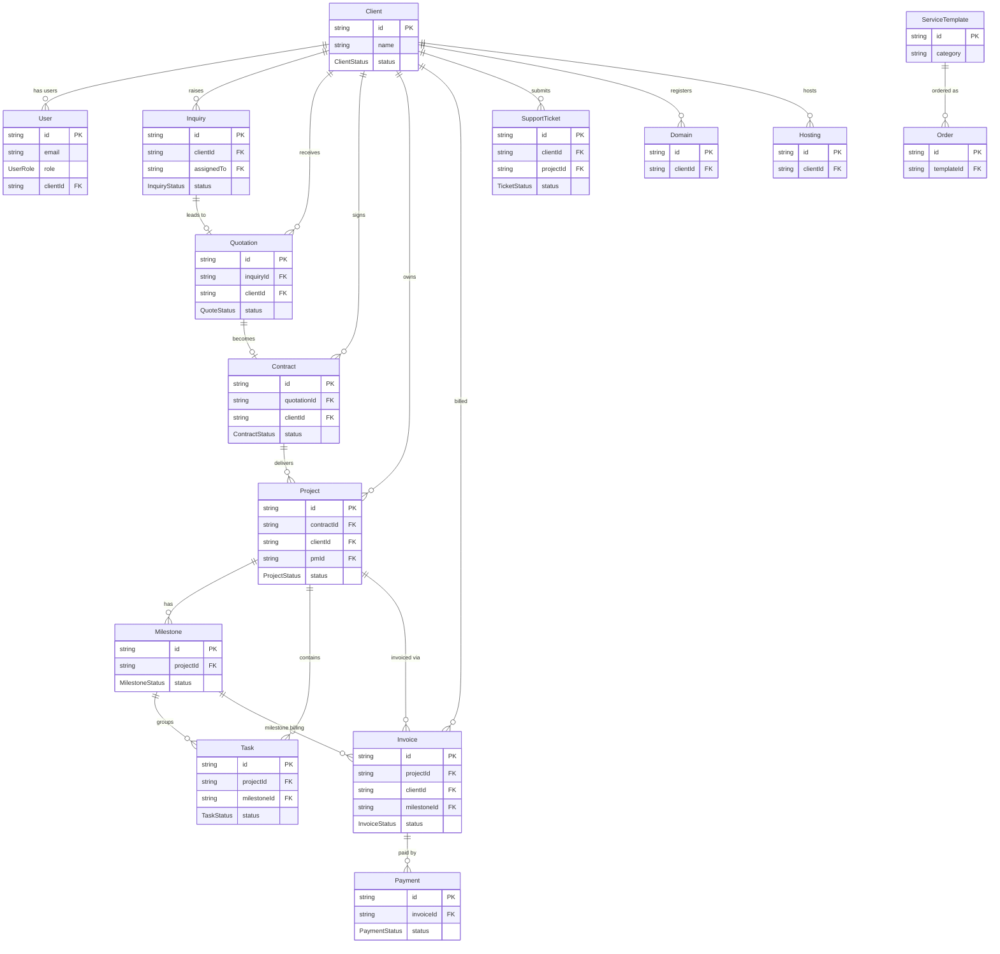

# Database

Kawasan Digital ID uses Neon (serverless PostgreSQL) via Prisma v7 with the `@prisma/adapter-neon` driver.

## Enums

| Enum | Values |
|------|--------|
| `UserRole` | `super_admin`, `sales`, `project_manager`, `developer`, `finance`, `support`, `infra`, `client_admin`, `client_contact` |
| `ClientStatus` | `Active`, `Inactive`, `Suspended`, `Archived` |
| `InquiryStatus` | `New`, `Qualified`, `Proposal_Sent`, `Contract_Pending`, `Won`, `Lost`, `Rejected` |
| `QuoteStatus` | `Draft`, `Sent`, `Accepted`, `Rejected`, `Expired` |
| `ContractStatus` | `Draft`, `Sent`, `Signed`, `Active`, `Completed`, `Terminated` |
| `ProjectStatus` | `Planning`, `In_Progress`, `On_Hold`, `Completed`, `Cancelled` |
| `MilestoneStatus` | `Pending`, `In_Progress`, `Completed`, `Approved` |
| `TaskStatus` | `To_Do`, `In_Progress`, `In_Review`, `Done` |
| `TaskPriority` | `Low`, `Medium`, `High`, `Critical` |
| `InvoiceStatus` | `Draft`, `Sent`, `Viewed`, `Paid`, `Overdue`, `Void`, `Bad_Debt` |
| `TicketPriority` | `Low`, `Medium`, `High`, `Critical` |
| `TicketStatus` | `Open`, `In_Progress`, `Escalated`, `Resolved`, `Closed` |
| `PaymentStatus` | `Pending`, `Verified`, `Failed` |

## All 22 Models

### NextAuth Adapter Tables

| Model | Table | Purpose |
|-------|-------|---------|
| `Account` | `accounts` | OAuth provider account links |
| `Session` | `sessions` | Database sessions (unused with JWT) |
| `VerificationToken` | `verification_tokens` | Email verification tokens |

### Core Identity

| Model | Table | Purpose |
|-------|-------|---------|
| `User` | `users` | Platform users with role-based access |
| `Profile` | `profiles` | Extended user profile data |

### Client & Sales

| Model | Table | Purpose |
|-------|-------|---------|
| `Client` | `clients` | Agency clients (companies) |
| `Inquiry` | `inquiries` | Sales inquiries from clients |
| `Quotation` | `quotations` | Price quotes linked to inquiries |
| `Contract` | `contracts` | Signed contracts linked to quotations |

### Projects & Tasks

| Model | Table | Purpose |
|-------|-------|---------|
| `Project` | `projects` | Delivery projects under contracts |
| `Milestone` | `milestones` | Project milestones with order index |
| `Task` | `tasks` | Individual tasks within projects |

### Finance

| Model | Table | Purpose |
|-------|-------|---------|
| `Invoice` | `invoices` | Invoices per project/milestone |
| `Payment` | `payments` | Payment records against invoices |

### Support

| Model | Table | Purpose |
|-------|-------|---------|
| `SupportTicket` | `support_tickets` | Client support tickets with SLA |

### Infrastructure

| Model | Table | Purpose |
|-------|-------|---------|
| `Domain` | `domains` | Client domain registrations |
| `Hosting` | `hostings` | Client hosting records |

### Storefront / E-commerce

| Model | Table | Purpose |
|-------|-------|---------|
| `ShowcaseProject` | `showcase_projects` | Portfolio items on storefront |
| `ServiceTemplate` | `service_templates` | Purchasable service packages |
| `TemplateFeature` | `template_features` | Add-on features for templates |
| `Order` | `orders` | Storefront orders |
| `CartItem` | `cart_items` | Shopping cart items per user |
| `Testimonial` | `testimonials` | Client testimonials on storefront |
| `StoreFaq` | `store_faqs` | FAQ entries on storefront |
| `CustomInquiry` | `custom_inquiries` | Custom project estimator submissions |

### Activity, Documents & Feedback

| Model | Table | Purpose |
|-------|-------|---------|
| `ActivityLog` | `activity_logs` | Audit trail per client |
| `ProjectDocument` | `project_documents` | File attachments on projects |
| `ProjectFeedback` | `project_feedback` | Client satisfaction ratings |
| `ContactMessage` | `contact_messages` | Contact form submissions |
| `MessageReply` | `message_replies` | Threaded replies to contact messages |

### Compliance / PDP

| Model | Table | Purpose |
|-------|-------|---------|
| `ConsentLog` | `consent_logs` | GDPR/PDP consent records |
| `DsarRequest` | `dsar_requests` | Data Subject Access Requests |

## Key Relationships

- **User → Client**: Many users belong to one client (`user.clientId → client.id`). Client-role users see only their own client's data.
- **Inquiry → Quotation → Contract → Project**: The core sales pipeline — each stage is a 1:1 optional link.
- **Project → Milestone → Task**: Hierarchical project breakdown. Tasks can optionally belong to a milestone.
- **Project → Invoice → Payment**: Financial chain. Invoices can be tied to a project and/or milestone.
- **Client → Domain / Hosting**: Infrastructure assets are owned per client.
- **ServiceTemplate → TemplateFeature**: Templates have optional add-on features with individual pricing.
- **ContactMessage → MessageReply**: Threaded inbox between clients and admin.

## ER Diagram (Key Relationships)

