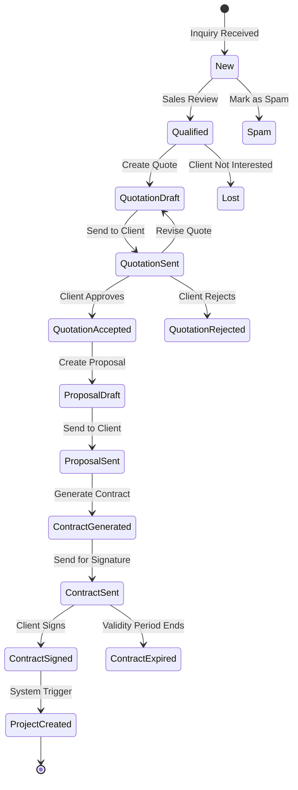
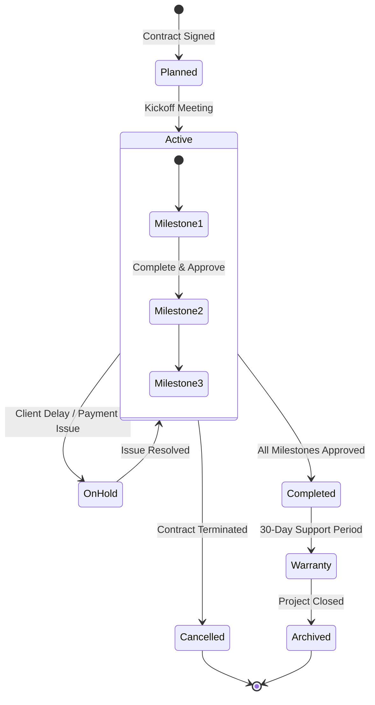
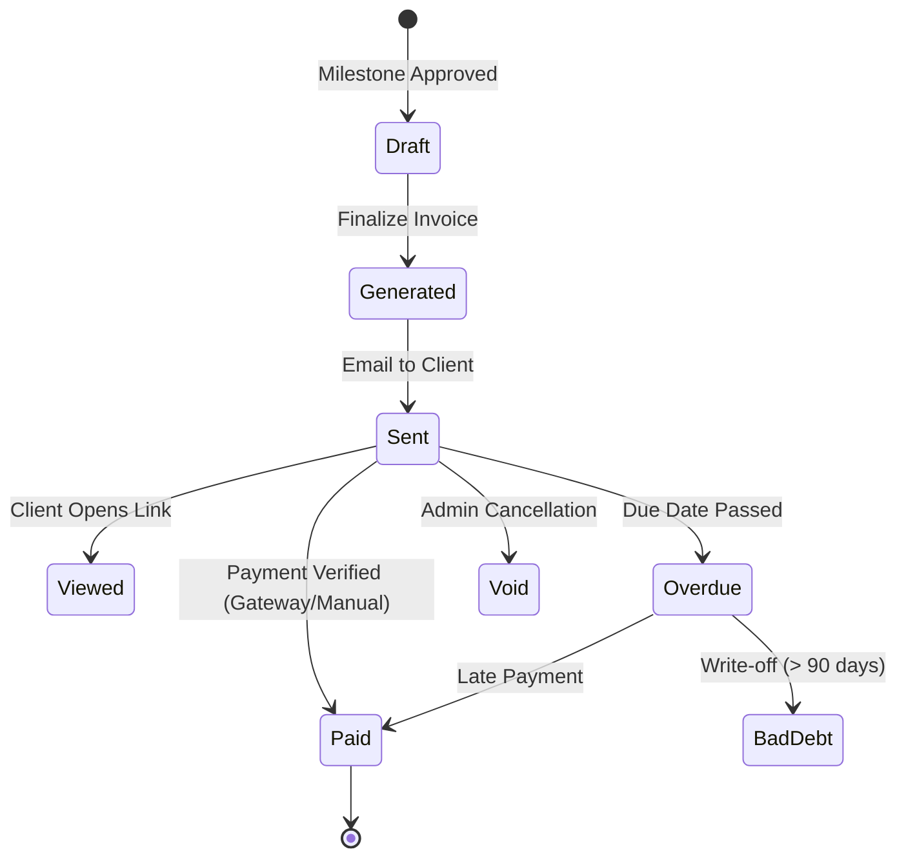
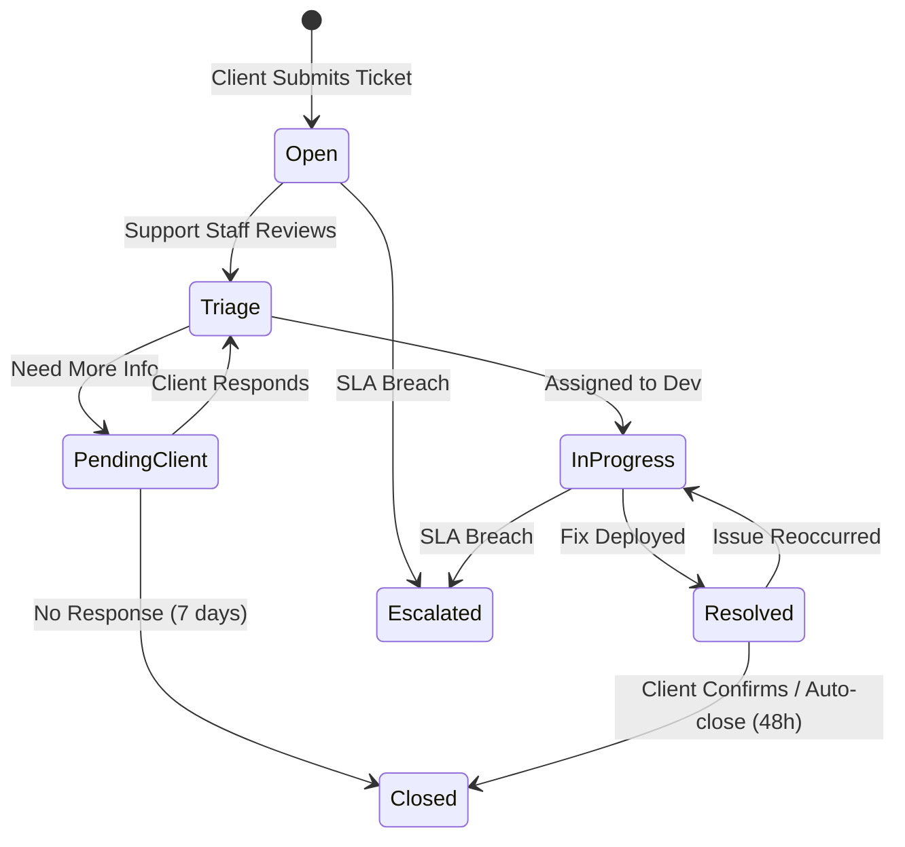
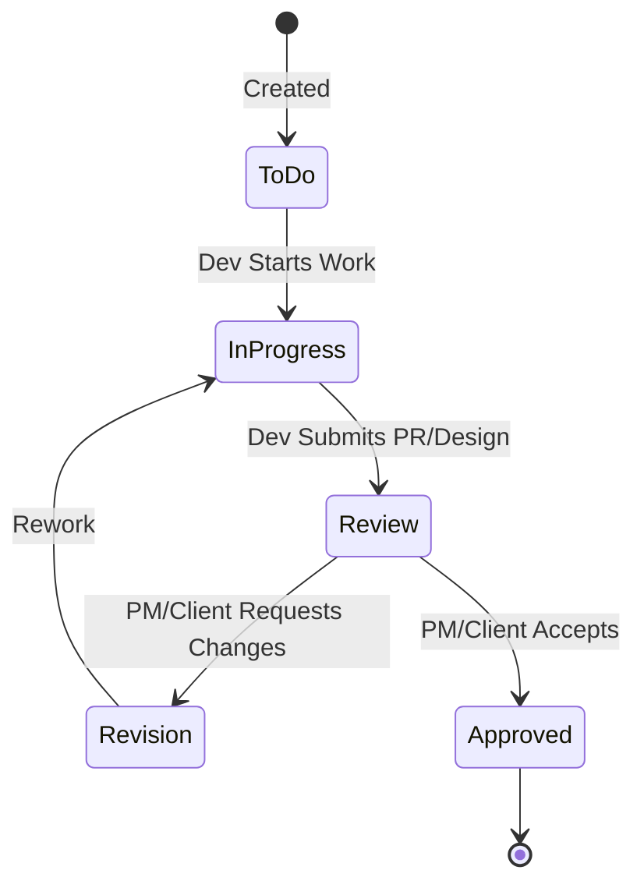

# Domain State Machines & Workflows

## 1. Overview
This document visualizes the core business logic and lifecycle states for the Agency Internal System. These state machines must be strictly enforced by the Backend Service Layer and reflected in the Frontend UI.

## 2. Sales Lifecycle (Inquiry to Contract)

The sales process moves from an initial Inquiry to a signed Contract.

## 3. Project Lifecycle

Projects track the delivery of work defined in the Contract.

## 4. Invoice Lifecycle

Invoices manage the financial realization of the project.

## 5. Support Ticket Lifecycle

Support tickets handle post-launch issues and requests.

## 6. Milestone & Task Workflow

Granular tracking of work within a project.

