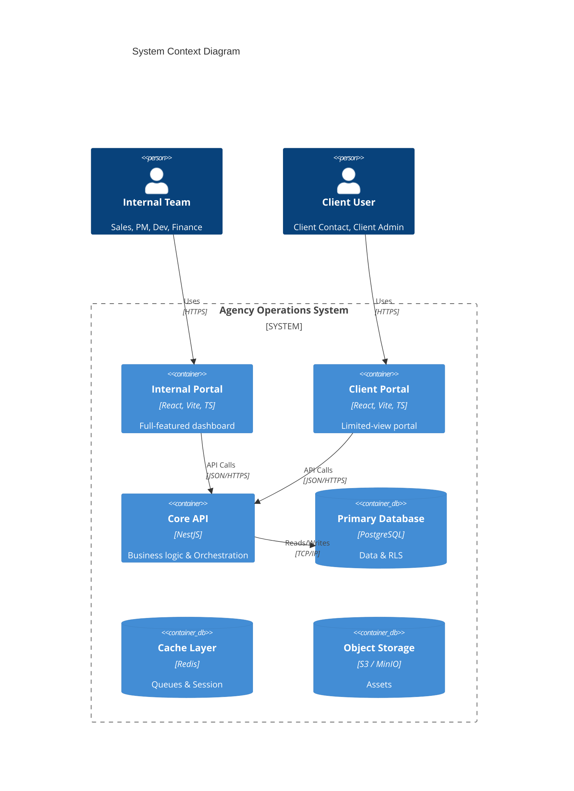

# System Architecture & Design Hub

## 1. Overview
This document serves as the central hub for the Agency Internal System's technical architecture. To adhere to the **Single Responsibility Principle**, detailed design specifications have been separated into domain-specific documents.

## 2. Architecture Documentation Map

| Domain | Document | Description |
|--------|----------|-------------|
| **Frontend** | **[Frontend Architecture](frontend-architecture.md)** | React/Vite stack, component patterns, state management, and UI performance strategy. |
| **Backend** | **[Backend Architecture](backend-architecture.md)** | NestJS modular monolith design, API patterns, database strategy, and DTO standards. |
| **Business Logic** | **[Domain State Machines](domain-state-machines.md)** | Visual workflows for Sales, Projects, Finance, and Support lifecycles (Mermaid diagrams). |
| **Security** | **[Security Architecture](security-architecture.md)** | Authentication (JWT), Authorization (RBAC/RLS), Compliance (GDPR/UU PDP), and Data Protection. |
| **Infrastructure** | **[Deployment & Infrastructure](deployment-infrastructure.md)** | Docker containerization, CI/CD pipelines (GitHub Actions), and Cloud deployment strategy. |
| **Testing** | **[Testing Strategy](testing-strategy.md)** | Testing pyramid (Unit, Integration, E2E), tools (Vitest, Playwright), and QA processes. |
| **Standards** | **[Development Standards](development-standards.md)** | Coding conventions, Git workflow, commit standards, and contribution guidelines. |
| **Database** | **[Database Schema](database-schema.md)** | Detailed ERD, table definitions, and SQL schema. |
| **API** | **[API Specification](api-specification.md)** | REST API endpoints, request/response formats, and OpenAPI spec. |

## 3. High-Level Architecture (C4 Container Diagram)

The system follows a **Modular Monolith** architecture to balance development speed (Phase 1) with future scalability (Phase 2).

## 4. Key Architectural Decisions

### 4.1. Unified Backend, Dual Frontend
We use a single NestJS backend to serve both the Internal Portal and Client Portal. This ensures:
-   **Shared Business Logic**: Pricing, state transitions, and validation are identical for both.
-   **Centralized Security**: RBAC and RLS are enforced in one place.
-   **Simplified Deployment**: One API service to manage and scale.

### 4.2. Defense in Depth
Security is applied at multiple layers:
1.  **Network**: WAF, DDoS protection, VPC isolation.
2.  **Application**: JWT Auth, Role Guards, Input Validation (Zod).
3.  **Data**: Row-Level Security (RLS) in Postgres, Encryption at Rest.

### 4.3. Scale-Ready Monolith
We build a monolith today but structure it for microservices tomorrow:
-   **Modular Folder Structure**: Features are isolated in `modules/`.
-   **Loose Coupling**: Modules communicate via Service Interfaces, not direct DB access.
-   **Async Processing**: Heavy tasks are offloaded to BullMQ/Redis immediately.
